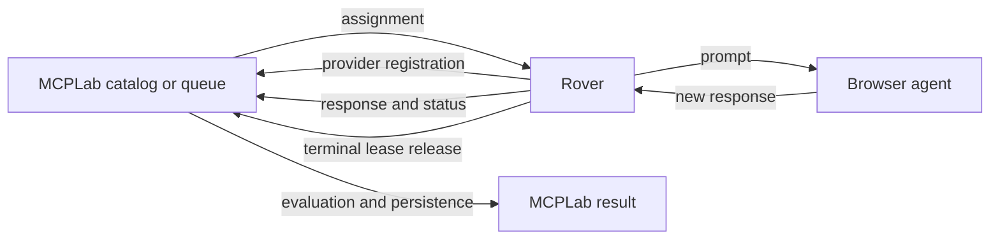

<p align="center">
  
</p>

<h1 align="center">MCPLab Rover</h1>

<p align="center">
  Run repeatable MCPLab evaluations inside the browser agents you already use.
</p>

<p align="center">
  <a href="https://github.com/inspectr-hq/mcplab-rover/releases/latest"></a>
  <a href="https://github.com/inspectr-hq/mcplab-rover/releases"></a>
  <a href="https://github.com/inspectr-hq/mcplab-rover/actions/workflows/test.yml"></a>
  <a href="https://github.com/inspectr-hq/mcplab-rover/releases/latest"></a>
</p>

---

## Take your evaluations into the browser

[MCPLab](https://github.com/inspectr-hq/mcplab) makes LLM and MCP behavior testable. Rover brings those evaluations to real browser-based agents.

Open Claude, ChatGPT, or a learned browser provider. Click the Rover extension, select an evaluation, and let Rover submit the prompt, capture the new response, and send it back to MCPLab for evaluation and reporting.

Rover does not replace MCPLab or act as an MCP proxy. It is the browser worker that connects MCPLab's evaluation pipeline to the agent UI you want to test.

## Features

- **Injected sidebar:** Open Rover from the Chrome toolbar as a compact notch that expands inside the active page.
- **Live evaluations:** Browse MCPLab evaluations, run one in the active agent, and open the persisted result in MCPLab.
- **Evaluation queues:** Run multiple scenarios sequentially, optionally starting a new conversation between them.
- **Central assignment:** Let MCPLab match queued work to the connected Rover and browser provider.
- **Reliable execution:** Explicit leases, stale-result protection, reconnect handling, cancellation, and durable terminal actions protect managed runs.
- **Automatic response capture:** Rover tracks newly created or changed assistant responses instead of reusing older page content.
- **Learned providers:** Teach Rover the composer and response layout of another browser agent from the UI.
- **Clear outcomes:** See passed, failed, incomplete, and error results with evaluated and unavailable check counts.
- **Local by default:** Rover accepts only loopback HTTP origins for its MCPLab connection.

## Install

### From a release

1. Download the ZIP from the [latest Rover release](https://github.com/inspectr-hq/mcplab-rover/releases/latest).
2. Unzip it to a permanent folder.
3. Open `chrome://extensions` in Chrome or another Chromium browser.
4. Enable **Developer mode**.
5. Click **Load unpacked** and select the unzipped folder.
6. Pin **MCPLab Rover** to the browser toolbar.

Firefox publishing instructions are in the [Firefox publishing guide](docs/firefox-publishing.md). Firefox support should be tested separately before publishing because the current extension manifest and API usage are Chrome-oriented.

## Connect MCPLab

Rover expects the MCPLab app at `http://127.0.0.1:8787` by default.

Start MCPLab:

```bash
npx @inspectr/mcplab app --open
```

Then open a supported browser agent and click the Rover toolbar icon. A pulsing green indicator shows that Rover is connected. Use the settings icon next to **MCPLab** if your local app uses another loopback port.

## Run an evaluation

### Automatically from MCPLab

1. Open **Run Evaluation** in MCPLab.
2. Select an evaluation, its scenarios, and a configured browser agent.
3. Choose whether Rover should start a new conversation between scenarios, then start the run.
4. MCPLab queues the work and automatically assigns it when a Rover connected to the matching browser provider is available.
5. Rover runs the scenarios sequentially in the bound browser tab and captures each new assistant response.
6. MCPLab evaluates and persists the responses while showing progress for the complete run.
7. Open the completed run in MCPLab to inspect its checks and result artifacts.

If no matching Rover is connected, use **Connect to Rover** in MCPLab to open the configured agent page, then click the Rover extension icon. The waiting assignment is delivered automatically after Rover connects.

### Run a Live Test from Rover

1. Open a browser agent and click the Rover extension icon to inject the sidebar.
2. Open the **Manual** tab and select an evaluation from the MCPLab catalog.
3. Review the prompt, then run it in the active supported agent.
4. On an unsupported page, copy the prompt, run it yourself, and paste the final response back into Rover.
5. Rover submits the captured or pasted response to MCPLab for evaluation.
6. Select **View in MCPLab** to inspect the completed result.

### Build a local queue in Rover

1. Open the **Queue** tab in a supported browser agent.
2. Add one or more evaluations from the MCPLab catalog.
3. Choose whether Rover should start a new conversation between evaluations.
4. Run the queue. Rover submits each prompt and captures the corresponding response.
5. Open completed results in MCPLab.

You can stop an active evaluation or queue from Rover. Closing the sidebar does not cancel running work, and clicking the toolbar icon again restores the current state.

## Supported browser agents

Rover includes adapters for:

- Claude
- ChatGPT
- Browser providers learned through Rover and stored by MCPLab

Provider sites change over time. Rover validates provider readiness before accepting centrally assigned work and keeps accepted work bound to its original tab.

## Rover and MCPLab

Rover is a companion to [MCPLab](https://github.com/inspectr-hq/mcplab), the open-source framework for testing how LLM agents use MCP tools.

| MCPLab owns | Rover owns |
| --- | --- |
| Evaluation definitions and assertions | Browser-provider detection |
| Queue ordering and provider matching | Prompt submission and response capture |
| Result evaluation and persistence | Active-tab binding and cancellation |
| Reports, history, and run artifacts | A recoverable mirror of the active assignment |

Learn more at [mcplab.inspectr.dev](https://mcplab.inspectr.dev/) or read Rover's [architecture guide](ARCHITECTURE.md).

## How it works



1. MCPLab owns the evaluation definitions, queue, provider matching, leases, evaluation logic, and persisted results.
2. Rover connects to the local MCPLab app and registers the provider detected in the active browser tab, including its extension version.
3. For centrally assigned work, Rover accepts one explicit lease and keeps the assignment bound to its provider tab. Local queue and Live Test runs use the same browser execution and capture path without a central assignment.
4. Rover submits the prompt and waits for a newly created or changed assistant response.
5. Rover sends the captured response and execution status to MCPLab. MCPLab evaluates it using the configured response and judge assertions, then persists the result.
6. Rover releases a managed lease when the assignment reaches a terminal outcome. The result is stored with Rover provenance and can be opened in MCPLab.

Browser-only runs do not observe MCP tool calls yet. Tool-dependent checks are reported as `not_evaluated`, which produces an `incomplete` outcome when all evaluated checks pass. Inspectr telemetry is planned as a later extension of the same evaluation pipeline.

## Development

### From source

Rover requires Node.js 20 or newer.

```bash
git clone https://github.com/inspectr-hq/mcplab-rover.git
cd mcplab-rover
npm install
npm run build
```

Open `chrome://extensions`, enable **Developer mode**, choose **Load unpacked**, and select the generated `dist/` directory.

### Commands

```bash
npm run dev        # rebuild the extension when files change
npm run typecheck  # check TypeScript
npm test           # run the test suite
npm run build      # create the production extension in dist/
```

After a rebuild, reload Rover from `chrome://extensions` and refresh the agent page before testing content-script changes.

## Feedback

Found a provider change or an evaluation that does not behave as expected? [Open an issue](https://github.com/inspectr-hq/mcplab-rover/issues).
